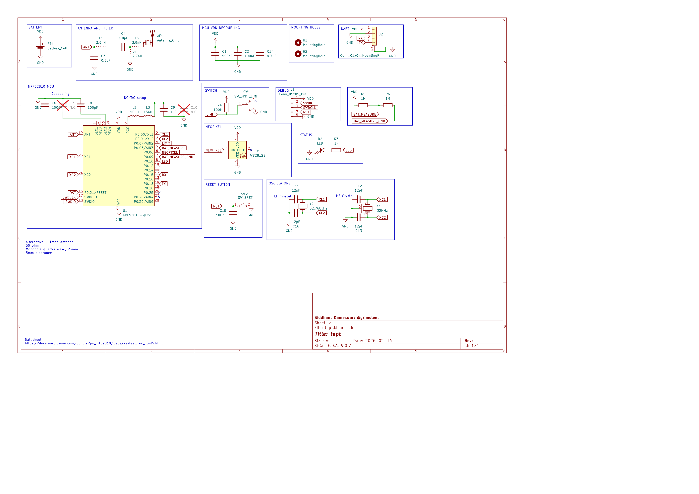
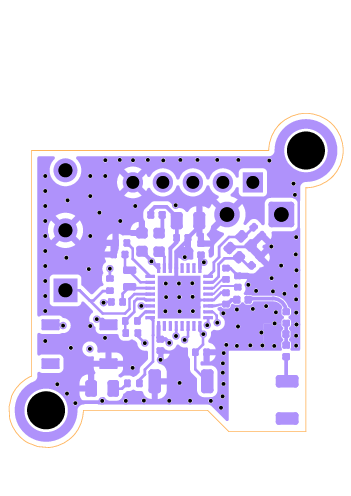
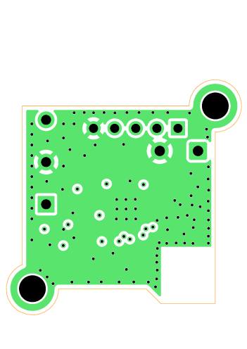
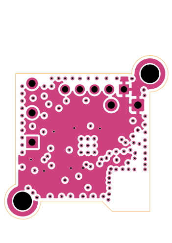
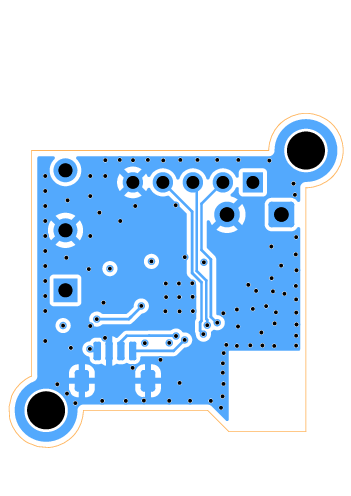
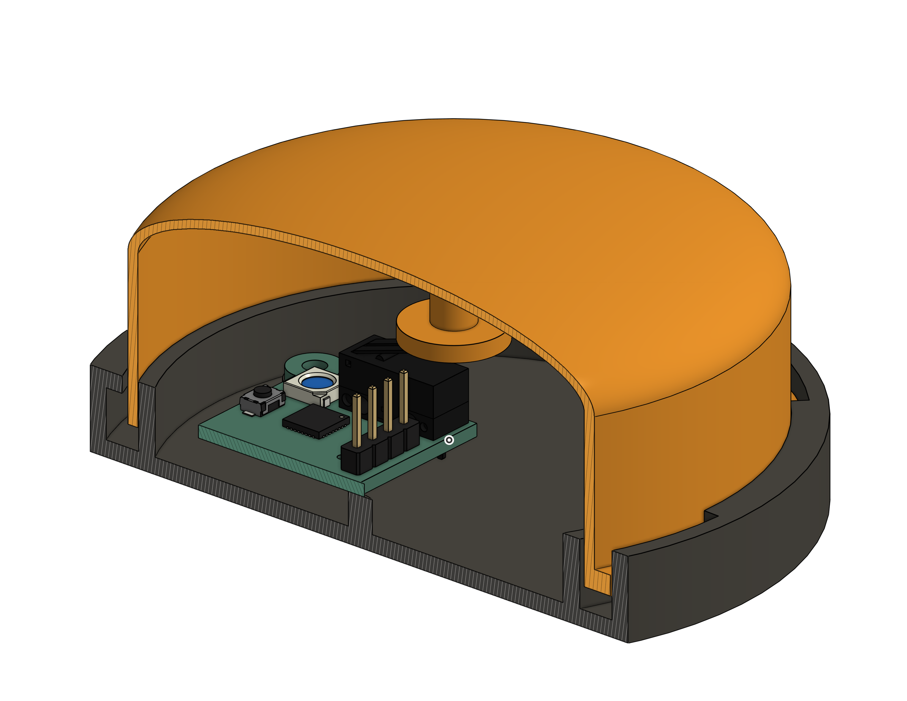

# tapt

> just a button

`tapt` is a BLE-powered IoT button. It uses an nRF52810 and can be powered for long periods of time on a single CR2032 battery.

It can be connected to Home Assistant and hooked up to automations from there.

## Usage

> Note: do NOT connect the battery when the board is powered on the debug header.

### Assembly

1. The 5 pin debug header must be soldered on for flashing
2. The battery holder can be soldered onto the back 
3. The WS2812B and the UART are optional. Both of these will cause more battery drain.
4. The PCB can be screwed into the base of the case. The button cap locks into the case.

### Flashing

> Note: An nRF-SDK environment is required. This is a *freestanding project*

1. Customize the device ID and board name if needed in `prj.conf`
1. Build the firmware:
   ```sh
   west build -b tapt -- -DBOARD_ROOT=.
   ```
1. Flash the nRF over SWD, using the SWD header on the board. The pins are labeled on the bottom.

   Firmware is included in the `./firmware` directory.
3. Profit. The button should be autodiscovered in Home Assistant, where it will expose a button entity.

## Purpose

I made this because I wanted a large button for controlling random automations.

I also wanted to learn more about RF PCB design, and the nRF chip was a great place to start.

## Schematic + PCB



| F.Cu                         | In1.Cu                       | In2.Cu                       | B.Cu                         |
|------------------------------|------------------------------|------------------------------|------------------------------|
|  |  |  |  |
|                              |                              |                              |                              |

## Case

Apart from the PCB, tapt just has two components: the base and the button. 




The PCB is screwed into the base, and the button sits inside the base. When pressed down, it presses the limit switch.

[Onshape link](https://cad.onshape.com/documents/617a57c855f6b668c2d4cd24/w/013e725e8d7df515c4261645/e/6602b3eddf1a670923f88f78)

## Bill of Materials

[BOM CSV](./bom.csv)

If the price is 0, I have the component already (basically everything except the PCB/PCBA). I added links for reference, though

| Description            | Part ID  | Link                                                 | Per-unit price | Board Quantity | Total Quantity | Extended? | Total Price | Running Price w/ Tax |
|------------------------|----------|------------------------------------------------------|----------------|----------------|----------------|-----------|-------------|----------------------|
| 2.4 GHz Chip Antenna   | C89334   | https://jlcpcb.com/partdetail/C89334                 | $0.62          | 1              | 5              | TRUE      | $6.1630     | $6.69                |
| 100nF Capacitor        | C1525    | https://jlcpcb.com/partdetail/C1525                  | $0.00          | 4              | 8              | FALSE     | $0.0104     | $6.70                |
| 0.8pF Capacitor        | C88902   | https://jlcpcb.com/partdetail/C88902                 | $0.04          | 1              | 20             | TRUE      | $3.7420     | $10.76               |
| 1.0pF Capacitor        | C1550    | https://jlcpcb.com/partdetail/C1550                  | $0.00          | 1              | 20             | FALSE     | $0.0240     | $10.79               |
| 100pF Capacitor        | C1546    | https://jlcpcb.com/partdetail/C1546                  | $0.00          | 1              | 2              | FALSE     | $0.0024     | $10.79               |
| 1uF Capacitor          | C28323   | https://jlcpcb.com/partdetail/C28323                 | $0.01          | 1              | 2              | FALSE     | $0.0254     | $10.82               |
| 12pF Capacitor         | C1547    | https://jlcpcb.com/partdetail/C1547                  | $0.00          | 4              | 8              | FALSE     | $0.0096     | $10.83               |
| 4.7uF Capacitor        | C19666   | https://jlcpcb.com/partdetail/C19666                 | $0.01          | 1              | 2              | FALSE     | $0.0206     | $10.85               |
| Green LED              | C2297    | https://jlcpcb.com/partdetail/C2297                  | $0.02          | 1              | 2              | FALSE     | $0.0314     | $10.88               |
| 3.9nH Inductor         | C14033   | https://jlcpcb.com/partdetail/C14033                 | $0.00          | 2              | 20             | FALSE     | $0.0800     | $10.97               |
| 10uH Inductor          | C86083   | https://jlcpcb.com/partdetail/C86083                 | $0.05          | 1              | 6              | TRUE      | $3.3412     | $14.60               |
| 15nH Inductor          | C27143   | https://jlcpcb.com/partdetail/C27143                 | $0.05          | 1              | 20             | FALSE     | $1.0200     | $15.71               |
| 2.7nH Inductor         | C27123   | https://jlcpcb.com/partdetail/C27123                 | $0.00          | 1              | 20             | TRUE      | $3.1360     | $19.12               |
| 1k Resistor            | C11702   | https://jlcpcb.com/partdetail/C11702                 | $0.00          | 1              | 2              | FALSE     | $0.0014     | $19.12               |
| 100k Resistor          | C25741   | https://jlcpcb.com/partdetail/C25741                 | $0.00          | 1              | 2              | FALSE     | $0.0016     | $19.12               |
| 1M Resistor            | C26083   | https://jlcpcb.com/partdetail/C26083                 | $0.00          | 2              | 4              | FALSE     | $0.0032     | $19.12               |
| SW_SPST Button         | C720477  | https://jlcpcb.com/partdetail/C720477                | $0.05          | 1              | 2              | FALSE     | $0.1082     | $19.24               |
| nRF52810-QCxx          | C519278  | https://jlcpcb.com/partdetail/C519278                | $2.99          | 1              | 2              | TRUE      | $9.0228     | $29.04               |
| 32MHz Crystal          | C2965582 | https://jlcpcb.com/partdetail/C2965582               | $0.07          | 1              | 6              | TRUE      | $3.4606     | $32.80               |
| 32.768kHz Crystal      | C97603   | https://jlcpcb.com/partdetail/C97603                 | $0.24          | 1              | 5              | TRUE      | $4.2365     | $37.40               |
| PCB                    |          |                                                      | $1.00          |                | 2              |           | $2.00       | $39.57               |
| PCBA Fees              |          |                                                      | $11.55         |                | 1              |           | $11.55      | $52.12               |
| PCB Shipping           |          |                                                      | $3.12          |                | 1              |           | $3.12       | $55.51               |
| Case                   |          | 3d-printed                                           | $0.00          |                | 1              |           | $0.00       | $55.51               |
| M3 Heatset             |          | https://www.aliexpress.us/item/3256802711669116.html | $0.00          |                | 2              |           | $0.00       | $55.51               |
| M3 Screw x 8mm         |          | https://www.aliexpress.us/item/2255801013414226.html | $0.00          |                | 2              |           | $0.00       | $55.51               |
| SPDT Limit Switch      |          | https://www.aliexpress.us/item/2255800451734482.html | $0.00          |                | 1              |           | $0.00       | $55.51               |
| 2.54mm Pin Header 1x05 |          | https://www.aliexpress.us/item/3256806247917356.html | $0.00          |                | 1              |           | $0.00       | $55.51               |
| CR2032 Holder          |          | https://www.aliexpress.us/item/3256810117671035.html | $0.00          |                | 1              |           | $0.00       | $55.51               |
