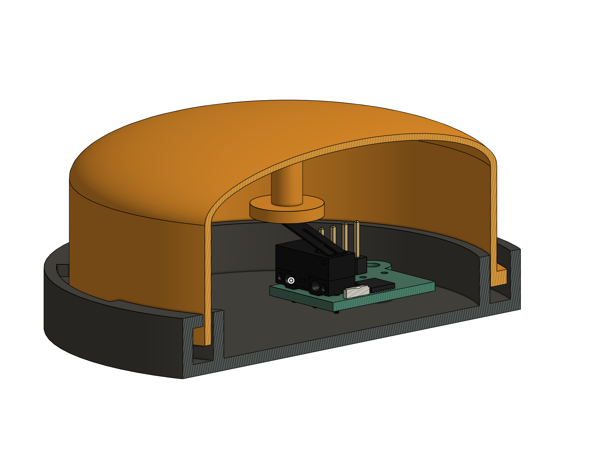

# Case CAD files

Apart from the PCB, tapt just has two components: the base and the button. 

The PCB is screwed into the base, and the button sits inside the base. When pressed down, it presses the limit switch.

[Onshape link](https://cad.onshape.com/documents/617a57c855f6b668c2d4cd24/w/013e725e8d7df515c4261645/e/6602b3eddf1a670923f88f78)
